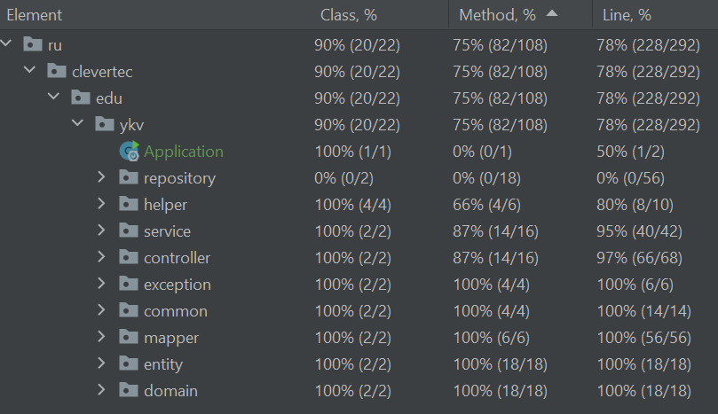

## Homework task for demonstrative test

REST API реализует CRUD операции
Приложение построено с использованием Spring Boot без подключения к базе данных.

- Spring Boot
- JUnit 5
- Mockito
- MapStruct
- Easy-random
- Lombok

Реализован REST API с CRUD операциями для сущности Rocket

Поля:
- id (UUID)
- name (String)
- rocketType (enum)
- country (String)
- startTestPeriod (LocalDate)
- endTestPeriod (LocalDate)

Значения RocketType (enum):
- PAPER
- WOOD
- PLASTIC
- IRON
- POTTERY
- SUGAR

Покрытие тестами

